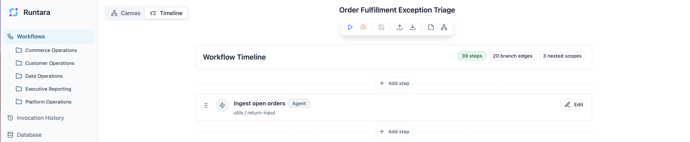
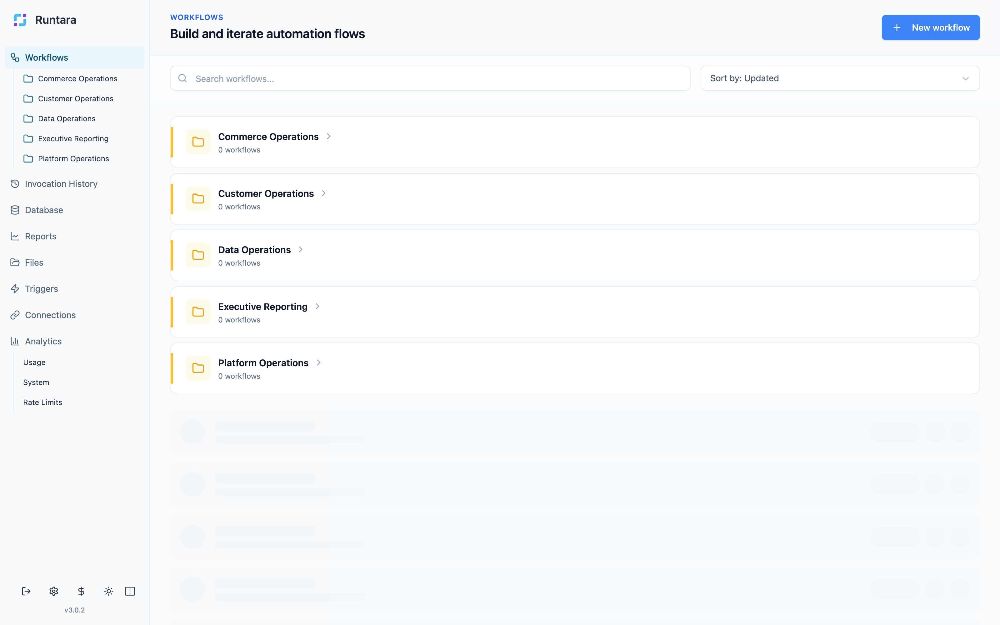
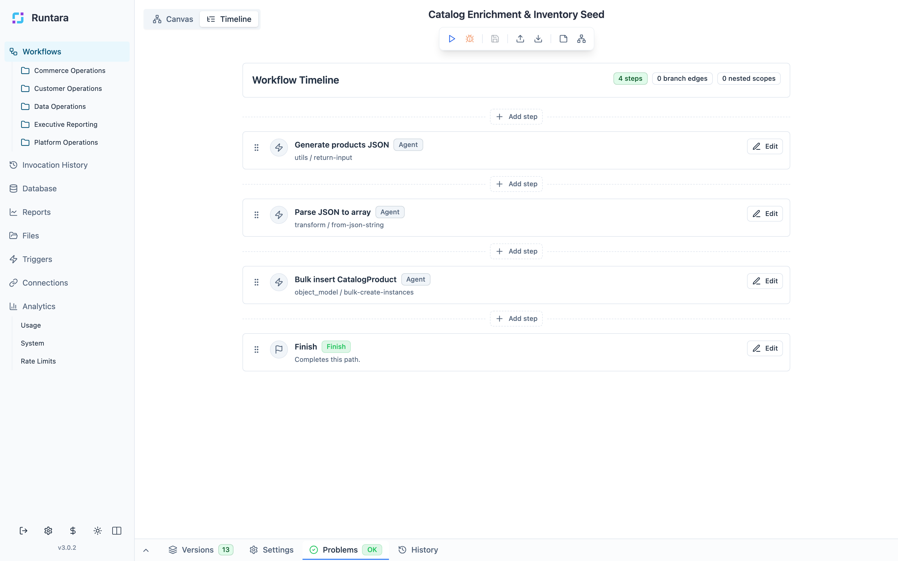
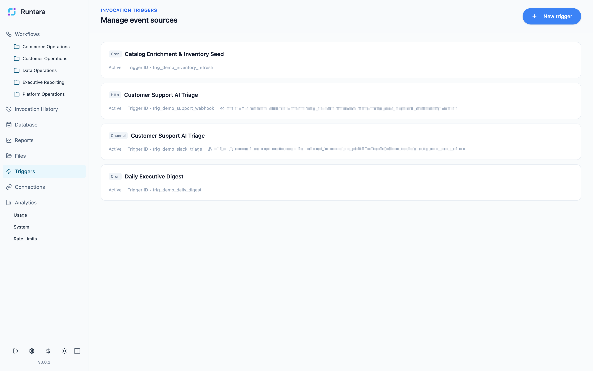
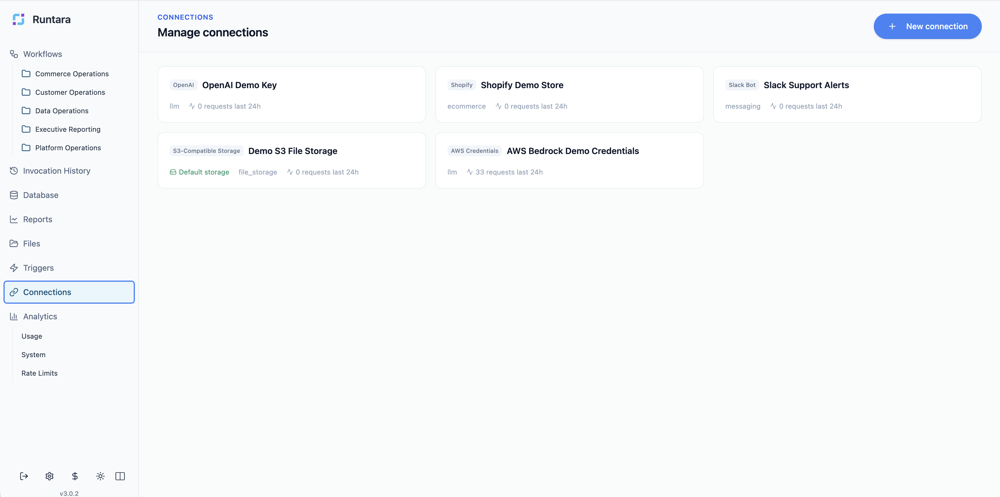
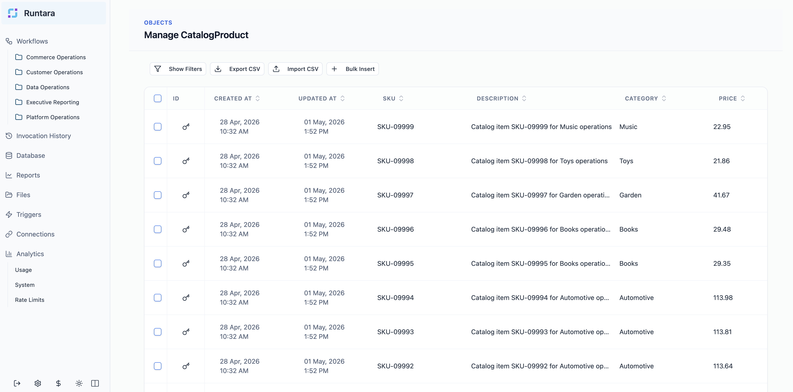
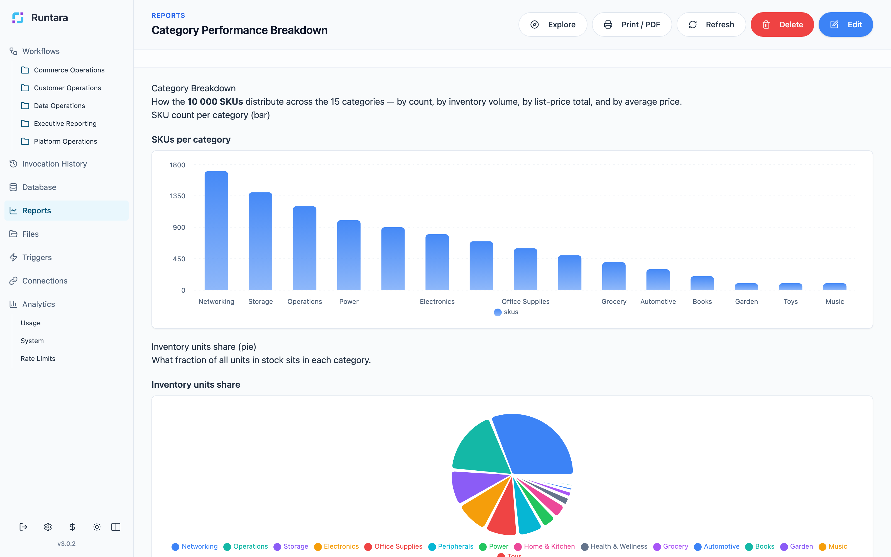
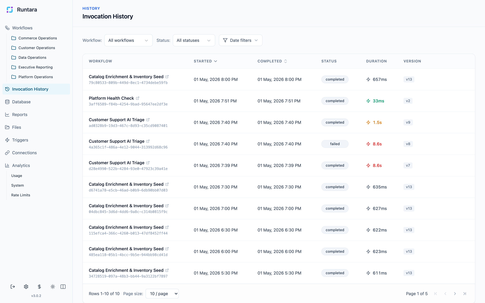
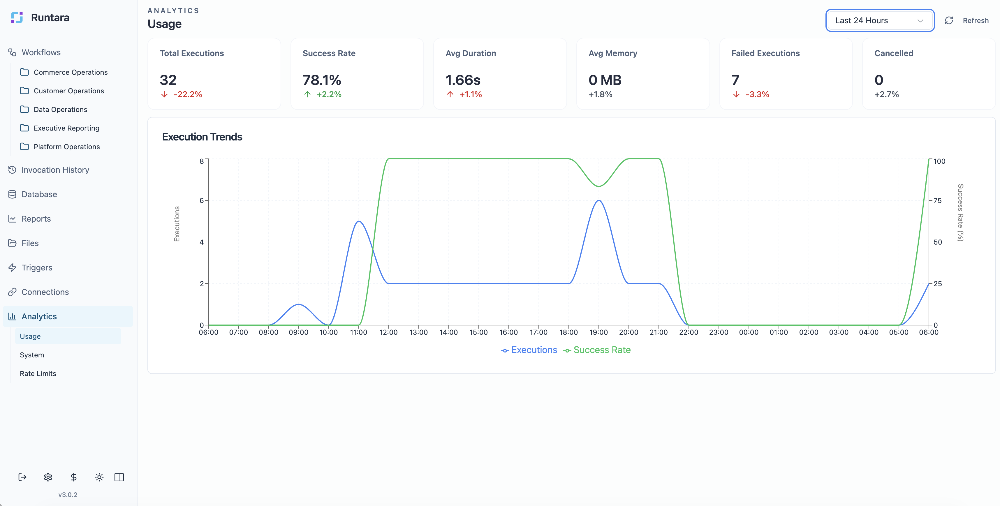

# Runtara

> Beta software. Product behavior, APIs, crate boundaries, and runtime behavior are still evolving.

**Secure AI automation from workflow design to live operations.**

Runtara is an end-to-end platform for building, running, and operating AI workflows. It brings workflow design, triggers, connections, operational data, files, reports, analytics, and durable execution into one workspace so teams can ship automations as production systems instead of loose prompt chains.

[Website](https://runtara.com) | [Product docs](https://runtara.com/docs/runtara-platform) | [Runtara Cloud](https://tally.so/r/81qE5o)



## What Runtara Does

Runtara gives builders and operators one product surface for AI automation:

- **Workflows**: design agent steps, transformations, waits, child workflows, and completion paths in timeline and canvas views.
- **Triggers**: start workflows from manual runs, chat, schedules, HTTP calls, and event-driven entry points.
- **Connections**: manage provider credentials, storage targets, and shared integrations outside workflow definitions.
- **Database**: model operational records such as catalogs, inventory, suppliers, support knowledge, and workflow-owned data.
- **Files**: store files created or consumed by workflow runs.
- **Reports**: publish narrative text, metrics, charts, tables, and reusable report definitions backed by Runtara data.
- **Invocation history**: inspect executions across workflows and triggers.
- **Analytics**: monitor usage, system health, rate limits, and execution trends.

## Product Tour

### Build Workflows As Operational Systems

Runtara organizes workflows by operational area and keeps builders focused on the process they own. Workflow definitions include structure, versions, validation, history, and run context.

| Workflow workspace | Timeline builder |
| --- | --- |
|  |  |

### Start Workflows From Real Events

Triggers let teams start automations from schedules, HTTP calls, and channel or event-driven entry points without duplicating workflow logic.



### Connect Agents To Data And Systems

Connections stay server-side. Workflow logic can use approved integrations and storage targets without embedding credentials in workflow definitions.

| Connections | Operational records |
| --- | --- |
|  |  |

### Publish Automation Outputs

Runtara reports turn workflow outputs and object data into pages people can use: narrative summaries, metrics, charts, tables, and reusable report definitions.



### Operate With Visibility

Invocation history and analytics give operators a live view of workflow health, usage, rate limits, and execution trends.

| Invocation history | Usage analytics |
| --- | --- |
|  |  |

## Runtime Design

Runtara combines the product surface above with runtime primitives for secure, durable AI automation:

- **Sandboxed agent runs**: workflow logic executes inside WebAssembly isolation by default with no raw filesystem, network, or credential access.
- **Credential mediation**: provider credentials remain server-side and are injected at the host boundary instead of being exposed to agents.
- **Durable checkpoints**: long-running agent loops checkpoint after tool calls, resume after crashes, and avoid replaying completed work.
- **Operational visibility**: reports, invocation history, analytics, files, and object data give teams a live surface for production automation.

At a high level, the Rust workspace is organized into three layers:

```text
┌──────────────────────────────────────────────────────────────────┐
│  runtara-server                                                  │
│  Full application server: workflows, connections, auth, MCP,     │
│  channels, workers, file storage, object model                   │
│  ┌────────────────────────────────────────────────────────────┐  │
│  │  runtara-environment                                       │  │
│  │  Management plane: image registry, instance lifecycle,     │  │
│  │  runners (Wasm/OCI/Native/Mock), wake scheduling           │  │
│  │  ┌──────────────────────────────────────────────────────┐  │  │
│  │  │  runtara-core + runtara-sdk                          │  │  │
│  │  │  Durable execution: checkpoints, signals, events,    │  │  │
│  │  │  durable sleep, compensation                          │  │  │
│  │  └──────────────────────────────────────────────────────┘  │  │
│  └────────────────────────────────────────────────────────────┘  │
└──────────────────────────────────────────────────────────────────┘
```

## Repository Contents

This repository contains the Rust implementation of the Runtara platform:

- `crates/runtara-server`: application HTTP API, auth, workflows, connections, channels, MCP integration, file storage, object model, and background workers.
- `crates/runtara-environment`: image registry, instance lifecycle, runners, and wake scheduling.
- `crates/runtara-core`: durable runtime persistence for checkpoints, signals, events, and sleep.
- `crates/runtara-sdk`: instance-side SDK used by compiled workflows.
- `crates/runtara-workflows`: workflow compiler and validation pipeline.
- `crates/runtara-dsl`: workflow and agent metadata types.
- `crates/runtara-connections`: connection management, OAuth2, and rate limiting.
- `crates/runtara-object-store`: schema-driven dynamic PostgreSQL object store.
- `crates/runtara-agents`, `crates/runtara-ai`, and `crates/runtara-workflow-stdlib`: built-in agents, AI helpers, and workflow runtime support.
- `docs`: architecture notes, DSL spec, deployment notes, and reference material.
- `e2e`: shell-based end-to-end tests and sample workflows.
- `dev`: local Docker Compose stack for development dependencies.

## Quick Start

### Prerequisites

- Rust toolchain, stable, Edition 2024.
- `wasm32-wasip2` target for default workflow compilation:

```bash
rustup target add wasm32-wasip2
```

- PostgreSQL for platform, environment, and core state.
- A separate PostgreSQL database for the object model when running `runtara-server`.
- Valkey or Redis for `runtara-server` checkpoint storage during workflow execution and MCP session recovery.
- `crun` and Linux container support only if you enable the OCI runner.

### Start The Local Runtime

For local development, use the included launcher:

```bash
./start.sh
```

`start.sh` runs `runtara-environment` with embedded `runtara-core`. See `./start.sh help` for supported environment variables.

To run the full application server directly:

```bash
export RUNTARA_DATABASE_URL=postgres://localhost/runtara
export OBJECT_MODEL_DATABASE_URL=postgres://localhost/runtara_object_model
export VALKEY_HOST=localhost
cargo run -p runtara-server --release
```

Default local ports:

| Component | Default port |
| --- | --- |
| `runtara-server` public API | `7001` |
| `runtara-server` internal API | `7002` |
| `runtara-environment` API | `8002` |
| `runtara-core` instance API | `8001` |

### Build And Test

```bash
cargo build
cargo test
```

Target specific crates when iterating:

```bash
cargo test -p runtara-core
cargo test -p runtara-environment
cargo test -p runtara-workflows
```

Run shell-based end-to-end checks:

```bash
./e2e/run_all.sh
```

## Workflow DSL

Runtara workflows are described as JSON execution graphs. A minimal workflow:

```json
{
  "name": "Simple Passthrough",
  "description": "A simple workflow that passes input directly to output",
  "steps": {
    "finish": {
      "stepType": "Finish",
      "id": "finish",
      "inputMapping": {
        "result": {
          "valueType": "reference",
          "value": "data.input"
        }
      }
    }
  },
  "entryPoint": "finish",
  "executionPlan": [],
  "variables": {},
  "inputSchema": {},
  "outputSchema": {}
}
```

Useful references:

- `docs/dsl_spec.json`
- `crates/runtara-dsl/README.md`
- `crates/runtara-workflows/README.md`

## Development References

- Full platform entry point: `crates/runtara-server`
- Durable runtime: `crates/runtara-core`
- Management plane: `crates/runtara-environment`
- Workflow compiler: `crates/runtara-workflows`
- Local development stack: `dev/README.md`
- Proxy and deployment notes: `docs/reference/proxy/README.md`

## License

Licensed under `AGPL-3.0-or-later`.

For commercial licensing options, contact `hello@syncmyorders.com`.

Copyright (C) 2025 SyncMyOrders Sp. z o.o.
