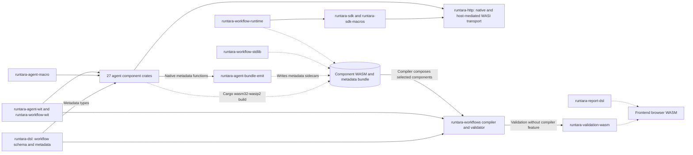

# Runtara component diagram

Snapshot: 2026-09-20, current working tree, including uncommitted trusted-capability support. Boxes represent logical components; the native components inside `runtara-server` run in one process. Core and Environment are embedded libraries, not separately deployed services.

Solid arrows show calls or data access. Dotted arrows show artifact production/loading or external integration. The diagram groups implementation details and is not an exhaustive Cargo dependency graph.

```mermaid
flowchart LR
    subgraph browser["Browser"]
        frontend["React frontend"]
        browserWasm["Validation and report WASM"]
        frontend --> browserWasm
    end

    clients["API and MCP clients; channel webhooks"]

    subgraph server["runtara-server native process"]
        api["HTTP APIs, MCP, auth, channels"]
        workers["Execution engine, outbox, workers"]
        compiler["runtara-workflows compiler"]
        environment["runtara-environment: lifecycle and runner"]
        core["runtara-core: durable state"]
        persistence["runtara-store-postgres"]
        host["runtara-component-host: Wasmtime"]
        hostIo["Host I/O bridge"]
        proxy["Internal HTTP proxy and native-agent API"]
        connections["runtara-connections; host runtara-agents"]
        objects["Object-store and report services"]
        trusted["Trusted executor and credential resolver"]

        subgraph sandbox["Host-managed WASM instances"]
            workflow["Compiled workflow and shared stdlib"]
            agents["Standalone agent components"]
            trustedGuest["Approved trusted capability instance"]
            workflow --> agents
        end

        api --> workers
        api --> objects
        api --> connections
        api -->|"Agent testing"| host
        workers --> compiler
        workers -->|"RuntimeClient: direct calls"| environment
        environment --> host
        environment --> core
        core --> persistence
        host -->|"Executes"| workflow
        workflow -->|"Runtime host imports via Environment"| core
        agents -->|"HTTP import"| hostIo
        hostIo -->|"Internal requests"| proxy
        proxy --> connections
        workflow -->|"Trusted host import"| trusted
        trusted --> connections
        trusted -->|"Fresh isolated invocation"| trustedGuest
    end

    postgres[("PostgreSQL: application, runtime, tenant data")]
    valkey[("Valkey: streams, sessions, rate limits")]
    artifacts[("Local WASM artifacts and metadata")]
    providers["External APIs, SFTP and object storage"]

    frontend -->|"HTTP and SSE"| api
    clients --> api
    workers --> postgres
    workers --> valkey
    api -->|"Session queues"| valkey
    connections --> postgres
    connections --> valkey
    objects --> postgres
    environment --> postgres
    persistence --> postgres
    compiler -.->|"Produces workflow artifacts"| artifacts
    artifacts -.->|"Loads components"| host
    proxy -.->|"Authorized requests"| providers
    hostIo -.->|"Direct HTTP transport"| providers
    connections -.->|"OAuth and native integrations"| providers
```

PostgreSQL is grouped by technology: application, runtime, and tenant object-store pools can point at different databases. Valkey is also shared infrastructure, not an execution-state substitute. The durable outbox is in PostgreSQL; Valkey streams relay work to workers.

Ordinary guests receive host-mediated I/O rather than raw sockets, filesystem access, or connection credentials. Approved trusted capabilities receive credentials for their allowed connection types in fresh instances whose HTTP/timer and filesystem access is denied. The trusted instance does not get a direct edge to an external provider. The server's existing native SFTP handler remains outside the guest sandbox.

The default compiler uses runtime host imports. The composed `runtara-workflow-runtime`/SDK route remains supported for compatibility and standalone execution, so its absence from the default runtime path does not make it unused.

## Build and contract components

Arrows in this second view describe build inputs and selected library uses. Shared dependencies such as `runtara-ai`, encoding, and trusted signing are mapped below rather than repeating every edge.

## Package map

Every workspace package is accounted for in these groups. Names omit the common `runtara-` prefix.

| Component group | Packages | Purpose |
| --- | --- | --- |
| Application | `server` | Composition root, APIs, auth, MCP, channels, workers, repositories, optional embedded frontend. |
| Durable execution | `core`, `store-postgres`, `environment` | State contracts and handlers, PostgreSQL implementation, launch queue, image lifecycle, wake scheduling, embedded runner. |
| Compilation and browser validation | `dsl`, `workflows`, `validation-wasm` | Schema/metadata, graph validation and direct WASM composition, browser validation binding. |
| Guest runtime | `workflow-stdlib`, `workflow-runtime`, `sdk`, `sdk-macros`, `http` | JSON/step evaluation, compatibility runtime component, durable execution SDK/macros, transport abstraction. |
| Component infrastructure | `component-host`, `agent-wit`, `workflow-wit`, `agent-macro`, `agent-bundle-emit`, `agent-trusted` | Wasmtime host, interface contracts, generated metadata glue, bundle metadata emitter, shared trusted signing logic. |
| Host and domain support | `agents`, `connections`, `object-store`, `report-dsl`, `text-parser`, `ai`, `agent-encoding` | Native SFTP/S3 and connection descriptors, OAuth/storage/rate limiting, tenant object data, report schema/rendering, channel text parsing, AI provider support, shared text decoding. |
| Agent components: local data | `agent-compression`, `agent-crypto`, `agent-xlsx`, `agent-xml`, `agent-csv`, `agent-utils`, `agent-datetime`, `agent-transform`, `agent-text` | Sandboxed data transformations. |
| Agent components: integrations | `agent-http`, `agent-mailgun`, `agent-slack`, `agent-teams`, `agent-openai`, `agent-ai-tools`, `agent-bedrock`, `agent-object-model`, `agent-s3-storage`, `agent-sqs`, `agent-azure-blob-storage`, `agent-sharepoint`, `agent-stripe`, `agent-hubspot`, `agent-quickbooks`, `agent-shopify`, `agent-sftp`, `agent-mcp` | Dynamically selected capabilities; SFTP forwards native execution to the host. |

The React app is a separate Node package inside `crates/runtara-server/frontend`. Its generated runtime/management clients are contracts, not additional Rust services. The browser router lazily loads workflow, connection, trigger, object, report, analytics, history, chat, and settings features.

## Source anchors

- [Native composition and dispatcher setup](../crates/runtara-server/src/server.rs#L1004), [trusted-executor wiring](../crates/runtara-server/src/server.rs#L1323), [embedded core/environment startup](../crates/runtara-server/src/embedded_runtara.rs#L67).
- [Direct Environment client](../crates/runtara-server/src/runtime_client.rs#L1), [execution engine](../crates/runtara-server/src/workers/execution_engine.rs#L333), [durable admission lifecycle observer](../crates/runtara-server/src/workers/execution_outbox.rs#L1366).
- [Host-mediated I/O](../crates/runtara-component-host/src/host_io.rs#L3), [native SFTP dispatch](../crates/runtara-server/src/api/handlers/internal_agents.rs#L169), [trusted credential resolver](../crates/runtara-server/src/api/services/trusted.rs#L1).
- [Default runtime binding](../crates/runtara-workflows/src/direct_wasm/compile.rs#L798), [component build and metadata emission](../scripts/build-agent-components.sh#L69), [browser validation build](../crates/runtara-server/frontend/scripts/build-validation-wasm.mjs#L18).
- [Frontend routes](../crates/runtara-server/frontend/src/router/index.tsx#L14), [browser report DSL loader](../crates/runtara-server/frontend/src/features/reports/hooks/useReportDsl.ts#L7).

See the [usage review](codebase-unused-review.md) for inactive paths and removal candidates. Inactive cancellation plumbing and speculative frontend exports are intentionally omitted from the active component diagram.
