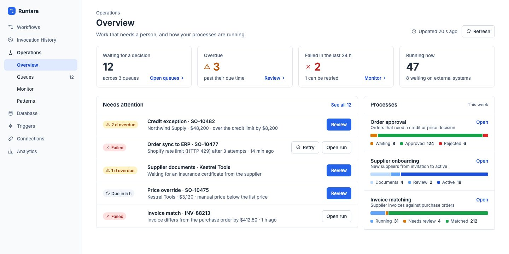
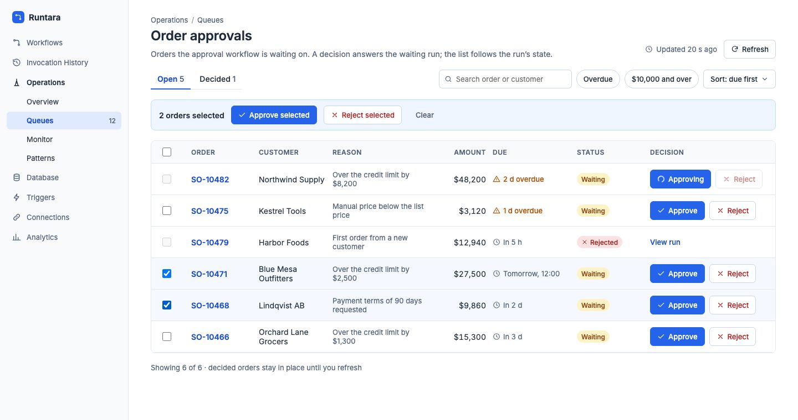
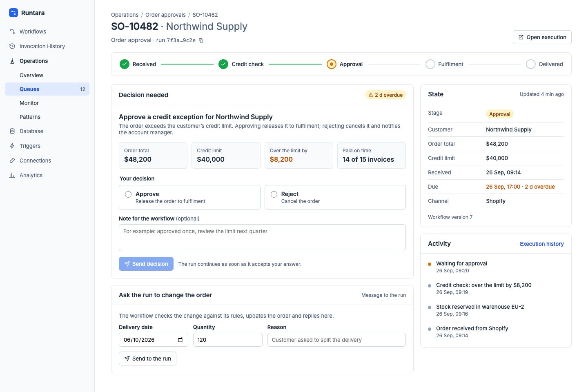
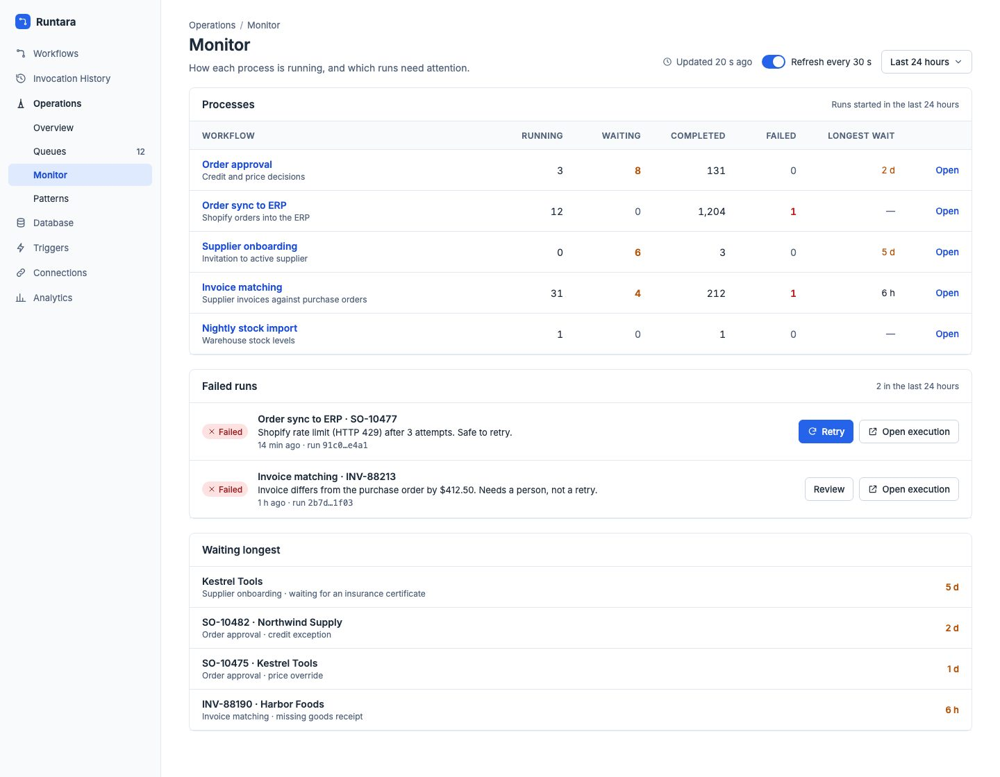
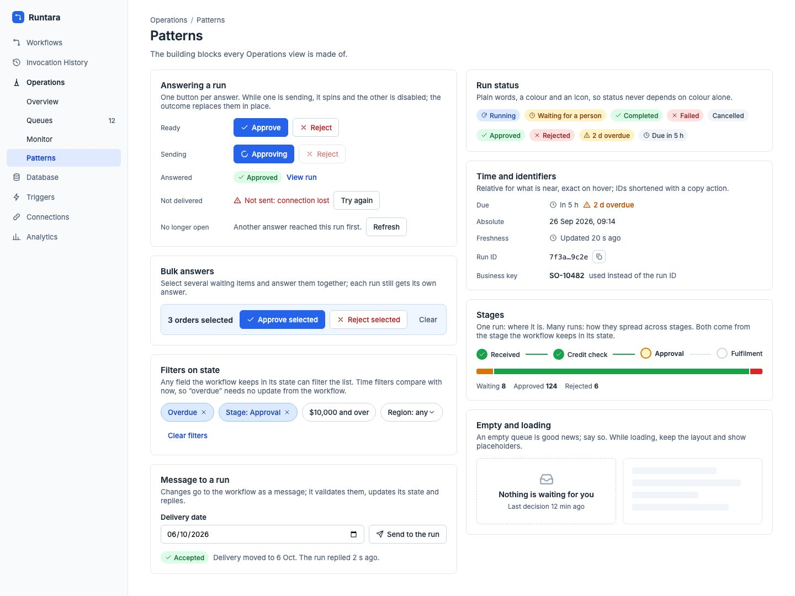
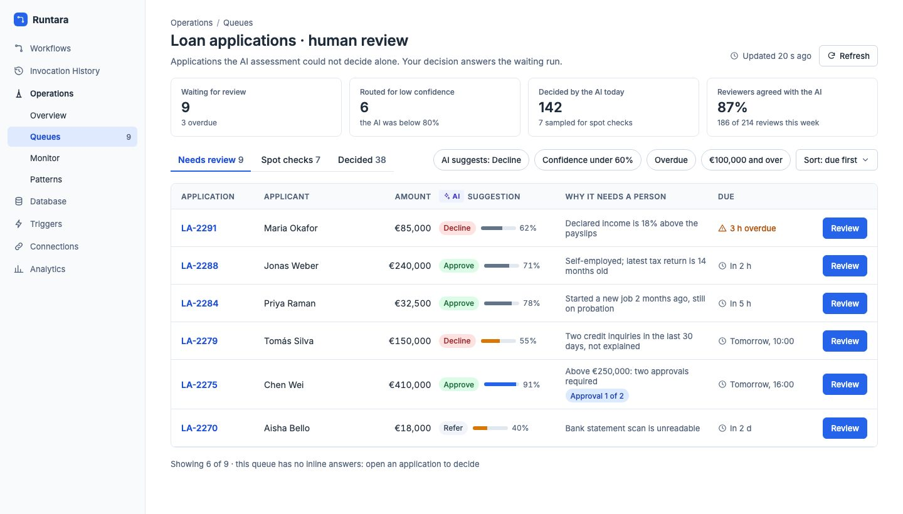
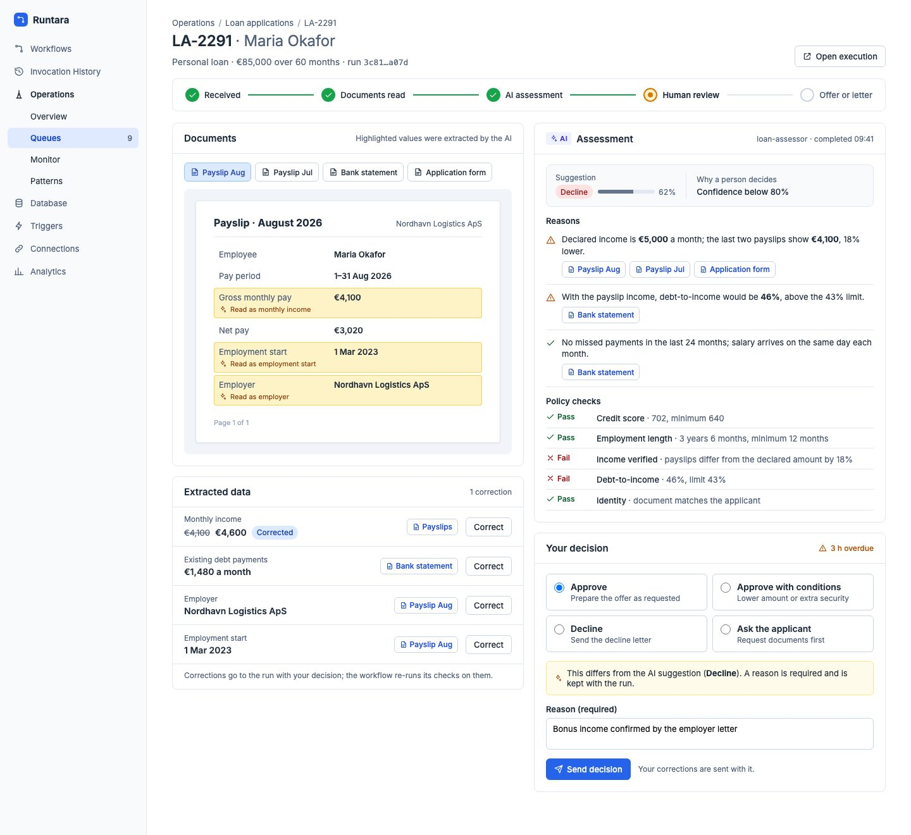
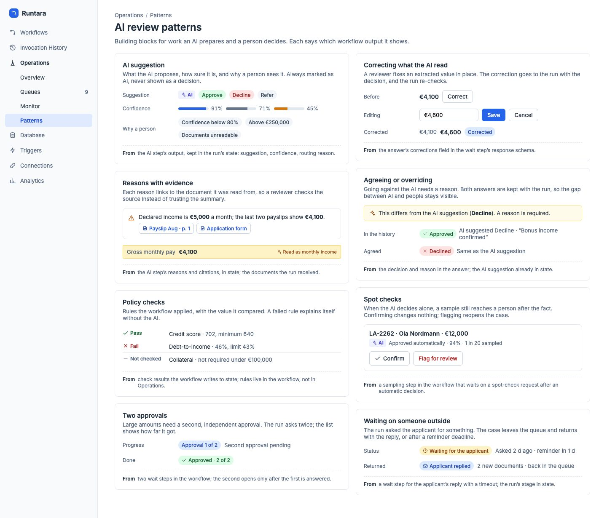

# Operations

Status: phases 1–4 implemented on `feat/operations`, 2026-09-29.
The original baseline was checked against `main` at `708286b5` (#279).
Phase 5 remains later work. See [Implementation](#implementation) for the
concrete API and validation coverage.
Monitor is consolidated into Runs; Overview no longer contains Processes.
See [Runs consolidation](operations-runs-consolidation.md) for behavior and validation.
The screenshots come from an interactive prototype and show sample data; what
each screen needs from the platform is listed under [Screens](#screens).

Operations is the part of Runtara where people work with running workflows:
answer what a workflow is waiting on, see where each run stands, and deal with
failures. It replaces reports (removed in #271), because Runtara is not a
reporting platform.

- [Principles](#principles)
- [Agreed decisions](#agreed-decisions)
- [What exists today](#what-exists-today)
- [Where the domain is configured](#where-the-domain-is-configured)
- [Views and queues](#views-and-queues)
- [Screens](#screens)
- [Patterns](#patterns)
- [AI review with a person in the loop](#ai-review-with-a-person-in-the-loop)
- [Work needed](#work-needed)
- [Phases](#phases)
- [Implementation](#implementation)
- [Out of scope](#out-of-scope)

## Principles

1. **People talk to workflows.** A decision answers a request the run is
   waiting on. Operations never writes a workflow's data directly.
2. **The workflow owns the domain.** Operations knows only generic concepts:
   runs, state, requests, answers, errors. Orders, loans or suppliers exist
   only in the workflows that model them.
3. **A fixed set of patterns.** Every screen is built from the same building
   blocks. There is no layout language and no page to design per case.
4. **Views are the only configuration.** A view chooses which runs or requests
   to show, how to arrange them and how to format their display. Formatting
   changes presentation only; views hold no data transforms or business logic.

## Agreed decisions

Agreed 2026-09-29; implemented for phases 1–4 below.

- **Approval queues have one row per request.** A run with several matching
  requests appears several times. Monitoring and plain run views retain one
  row per run. Queue counts, pagination, selection and answers use requests.
- **Queries return selected state fields.** The caller explicitly names the
  top-level fields needed for the view. Omitting the selection preserves the
  existing response without state. This supersedes the earlier decision in
  `docs/queryable-workflow-state.md` that lists never return state; the
  control agent's existing query contract remains unchanged.
- **Actor attribution ships with the first Operations release.** Record the
  authenticated actor for answers from the start. Enforcing two different
  human approvers is separate, later work; recording identity alone does not
  enforce that rule.
- **Workflows may answer queued requests.** Keep the existing `action.key`
  opt-in for `control:send-signal`. People and workflows may both answer;
  the first accepted answer wins.
- **Additional answer fields are edited in place in the table.** Show the
  required controls in each selected request's row, with separate values and
  validation errors per row. Do not open a sequence of popups or forms.
  Users can review and edit all selected requests together before submitting.
  One-click bulk answers apply only when no extra input is needed and the
  selected answer is valid for each request.
- **Queues survive workflow version changes.** An action key removed from
  the current version remains discoverable as a queue while actionable
  requests for it remain. Each answer form uses the immutable schema stored
  with its request, not the workflow's current schema.
- **Replay preserves the business label.** Replaying `ORDER-123` creates a
  new run ID with the same `runLabel`, `ORDER-123`, and retains the existing
  link to the original run. An unlabeled run remains unlabeled.
- **Shared-view authoring uses `workflow:update`.** Creating and editing
  shared views requires this existing permission. Reading views uses
  `invocation_history:read`; answering requests uses `workflow:execute`.
- **Each queue belongs to one workflow initially.** Matching action keys on
  different workflows do not combine their requests into one queue. The
  Overview shows queues across workflows together. Cross-workflow queues
  are deferred.
- **Currency is presentation, not a platform concept.** Workflows publish
  ordinary numbers or strings. Display formatting belongs in the view
  configuration, or the workflow supplies already formatted text. Operations
  adds no currency-specific schema fields, currency-code references, input
  controls or business rules.

## What exists today

This section records the original `708286b5` baseline. The implementation
section below supersedes its descriptions of missing Operations features.

Paths are relative to `crates/`.

| Concept | Where it comes from | Status |
|---|---|---|
| Run status | `queued`, `compiling`, `running`, `suspended`, `completed`, `failed`, `timeout`, `cancelled`; a suspended run has a `suspensionReason` (`waiting_signal`, `waiting_instances`, `paused`, `sleeping`, `shutdown`) | yes |
| Business key | Run label: set by the execute API (`runLabel`), HTTP event and sync triggers (`?runLabel=`) and `control:start`. Cron, chat, channel and replayed runs have none. Filter is exact match (`runLabel`); `search` also matches it as a substring | yes |
| Parent run | `parentInstanceId` on runs started by `control:start`, with a list filter | yes |
| State | `stateSchema` on the graph; `SetState` / `GetState` steps (DSL 3.5.0); stored in `instance_state` (64 KiB cap, UTC date-times) | yes |
| Reading state | One run: `GET /api/runtime/workflows/instances/{id}` returns `state` and `stateUpdatedAt`. The workflow-scoped `GET /workflows/{wf}/instances/{id}`, which the run detail page uses, does not | partly |
| Filtering by state | `POST /api/runtime/executions/query`: the list filters plus `state: [{field, op, value}]`, ops `eq ne in lt lte gt gte exists`, top-level fields, literals only (no `now`), at most 16 filters. Returns runs, never their state (a settled decision of the state design) | yes |
| Open request | A `WaitForSignal` step with `responseSchema`, `timeoutMs` and `action: {key, correlation, context}`, evaluated when the wait opens. Stored in `instance_input_requests` (state open, accepted or closed; deadline); the action key lives only inside the `spec` JSON, with no column or index | yes |
| Listing requests | Per run: `.../instances/{id}/pending-input` and `.../instances/{id}/actions`. Per workflow: `GET /workflows/{wf}/actions` (paging only, no key filter). The list shows `hasPendingInput` per run. Nothing lists requests tenant-wide or by action key | partly |
| Answering | `POST /api/runtime/signals/{instanceId}` with `{requestId, operationId, payload}` returns a receipt. The first answer wins (`INPUT_ALREADY_ANSWERED`); the same `operationId` replays the receipt; a closed request or ended run is `INPUT_INACTIVE`; a schema failure is `INPUT_INVALID_PAYLOAD` | yes |
| Answer validation | Server checks types and `required`; for flat field maps it does not enforce `enum`, `pattern` or `min`/`max` (`runtara-dsl/src/input_validation.rs`). The UI form does | partly |
| Who answered | Not recorded for answers from the UI, API or channels (`acceptance_context` stays empty). `control:send-signal` records the calling run. `audit_events` exists but is written only for API tokens and control mutations | no |
| Errors | A run's `error` is a string. The structured error (`code`, `category`, `severity`, `retryable`, `attributes`) is on the failed step, through step summaries (`GET /workflows/{wf}/instances/{id}/steps`). List rows carry no error | partly |
| Run actions | Stop, pause, resume (`POST /workflows/instances/{id}/stop\|pause\|resume`); replay (`.../replay`) starts a new run of the latest version with the original inputs and no label. There is no retry from the failed step | yes |
| Other runs from a workflow | Control agent: `get`, `get-state`, `query` (with a state filter), `list-pending-signals`, `send-signal`, `start`, `cancel`, `pause`, `resume` | yes |
| Messages to a run | A per-run mailbox is designed in `docs/queryable-workflow-state.md`; not implemented | no |
| Access | Tenant-wide roles (owner, admin, member, viewer). Reading runs is `invocation_history:read`; answering and run actions are `workflow:execute`. No per-workflow access | yes |
| Updates | Polling (the UI refetches every 10 s); no push for run changes | yes |

The existing UI already has most of the pieces (under
`runtara-server/frontend/src/`):

- the tenant-wide run list (`features/invocation-history`), with an "Input"
  chip on runs that wait;
- run detail (`features/workflows/pages/WorkflowHistory`) with the error,
  inputs, outputs, steps, timeline, graph replay, and pending requests
  answered in place (`HumanInputCard`, `ActionForm`);
- schema-driven forms (`shared/forms`: `FormRenderer`, `FieldControl`), with
  enum, textarea, date and datetime controls;
- console tables (`shared/components/console`, `shared/components/table`),
  status pills and relative time.

Run state is not shown anywhere yet, and `POST /executions/query` has no
caller in the UI.

## Where the domain is configured

In the workflow. Its author describes the process in generic terms. First, the
state a run exposes, with labels and formats (`stateSchema`, same `SchemaField`
format as `inputSchema`):

```json
"stateSchema": {
  "order":    { "type": "string", "label": "Order" },
  "customer": { "type": "string", "label": "Customer" },
  "amount":   { "type": "number", "label": "Amount" },
  "stage":    { "type": "string", "label": "Stage",
                "enum": ["received", "credit_check", "approval", "fulfilment", "delivered"] },
  "dueAt":    { "type": "string", "format": "datetime", "label": "Due" }
}
```

The amount is an ordinary number. A view may format its display using generic
number formatting and literal prefixes or suffixes, or the workflow may
publish a string such as `"$48,200"`. If numeric filtering and sorting are
needed alongside preformatted text, the workflow can expose separate numeric
and display fields. Presentation does not change stored values or query
semantics. The existing DSL `currency` format hint does not introduce a
currency domain model or require currency-specific work in Operations.

Then the steps that write it, wherever the process moves on:

```json
"toApproval": {
  "stepType": "SetState",
  "values": {
    "stage": { "valueType": "immediate", "value": "approval" },
    "dueAt": { "valueType": "reference", "value": "steps.deadline.outputs.at" }
  }
}
```

Then the question the run asks a person:

```json
"approve": {
  "stepType": "WaitForSignal",
  "action": {
    "key": "credit_exception",
    "context": { "limit": { "valueType": "reference", "value": "steps.credit.outputs.limit" } }
  },
  "responseSchema": {
    "decision": { "type": "string", "enum": ["approve", "reject"], "required": true },
    "note":     { "type": "string", "format": "textarea" }
  },
  "timeoutMs": { "valueType": "immediate", "value": 259200000 }
}
```

From these, Operations draws:

- columns and labels, and the state panel;
- the stage stepper and stage bars, from an ordered enum;
- overdue markers, from a date-time field compared with the viewer's clock;
- the answer form and its context, and answer buttons from an enum in the
  answer.

The failed step's error category tells a transient failure from one that needs
a person.

`action.key` has a second role today: it is the opt-in that lets any run of
the tenant answer the request through `control:send-signal` (control decision
D1). Queues use the same key, so a request that people answer from a queue is
also one another workflow may answer.

## Views and queues

A **view** is a saved query over runs or their actionable requests plus
presentation choices, stored as data in Operations:

```json
{
  "name": "Order approvals",
  "item": { "one": "approval request", "other": "approval requests" },
  "workflow": "order-approval",
  "where": {
    "openRequest": "credit_exception",
    "state": [{ "field": "amount", "op": "gte", "value": 10000 }]
  },
  "columns": ["order", "customer", "amount", "dueAt"],
  "sort": [{ "field": "dueAt" }],
  "roles": { "key": "order", "stage": "stage", "due": "dueAt" },
  "answers": { "inline": "decision", "bulk": true }
}
```

- **`where.state` is the existing filter** of `POST /executions/query`, stored
  as is. A time filter such as "overdue" stores a relative value (`now`) that
  the UI turns into a literal when it runs the query, since the server takes
  literals only.
- **Roles live in the view.** Which field is the business key, the stage or
  the due date is the view's choice, so a workflow's state stays plain typed
  data and two views can read the same state differently. Without a `key`
  role, the run label is the key.
- **Display formatting lives in the view or the value.** Columns can apply
  presentation-only formatting to typed values, or display strings already
  formatted by the workflow. Formatting does not write state or alter the
  values used for filtering, sorting or answering requests.
- A **queue** is a view with `openRequest`: one row per actionable request of
  that action key within the view's single required workflow, with its run's
  selected state fields. Several matching
  requests on one run produce separate rows, identified by run and request
  IDs. Counts and pagination are over requests, not distinct runs. A view
  without it is a plain list of runs, for example "Orders in fulfilment"
  (`stage eq fulfilment`).
- **Several queues** can read one workflow:

  | Queue | Workflow | Request | Filter |
  |---|---|---|---|
  | Credit exceptions | order-approval | `credit_exception` | none |
  | Large EU orders | order-approval | `credit_exception` | `amount gte 10000`, `region eq EU` |
  | Price overrides | order-approval | `price_override` | none |
  | Supplier documents | supplier-onboarding | `documents_review` | none |

- **Who defines them.** Every `WaitForSignal` step with an `action.key` in a
  workflow's current version gives a default queue, derived when Operations
  reads the workflow and named after the step, with the state fields as
  columns. Discovery also includes action keys on actionable requests from
  older versions, so removing a step or key cannot hide outstanding work.
  Nothing is stored until someone changes it. People who run the
  process refine queues, or add new ones, in Operations. The workflow does not
  change.
- **Access** follows the existing roles: `invocation_history:read` sees views
  and runs, `workflow:execute` answers (the permission `POST /signals` already
  requires). Creating and editing shared saved views requires `workflow:update`.

The words on a screen come from three places:

| On screen | Source | Set by |
|---|---|---|
| "Order approvals" | view name | queue |
| "2 requests selected" | request count; queue item names must describe requests when runs can repeat | queue |
| Order, Customer, Amount columns | state field labels | workflow |
| Reason column | column label override (default: the field label) | queue |
| SO-10482 | the view's `key` role, or the run label | queue or workflow |
| $48,200 | view display formatting or workflow-provided text | queue or workflow |
| Approve, Reject | answer options (`enum` in `responseSchema`) | workflow |
| 2 d overdue | the view's `due` role against now | queue |
| Waiting, Approved, Rejected | run status and the answer given | platform |

## Screens

Each screen lists what it reads and what it lacks today. Work items are
numbered in [Work needed](#work-needed).

### Overview

Requests to answer and recent failures to review, with concise totals linking
to Queues and filtered Runs. The Processes area and its stage bars from the
original prototype below have been removed.



- Reads: actionable queue counts, request previews with configured due fields,
  recent failures, and aggregate running counts. There are no per-process or
  per-stage count requests.

### Queue

One row per actionable request. An answer button submits immediately when no
additional input is needed; otherwise it reveals editable fields in that row.
For bulk answers, selected rows form an editable table with separate values
and validation errors per request. Users edit the rows in place before
submitting. While an answer is sending, its button spins and the other answer
is disabled, and the outcome replaces the buttons in place until the next
refresh. Controls use each request's registered schema. Filters work on any
state field, including time compared with now.



- Reads: the request query added in W2 with run-state filters and selected
  state fields; `POST /signals` to answer, one call per request.
- Lacks: request-level querying and pagination by action key (W2), state
  values for the columns (W3), sort by a state field (W4).

### Run detail

One run: its stages, the open request with its context and answer form, its
current state and its activity. Steps, inputs, outputs and the timeline stay
on the existing run page, which this screen links to.



- Reads: the single-run endpoint (state), pending requests of the run (already
  on the existing run page), step summaries.
- Lacks: a read-only renderer for state values (W5). The "message to the run"
  box needs messages (W9) and stays hidden until they exist.

### Runs (replaces Monitor)

One paginated run list with status quick filters, workflow/search/date filters,
readable failure summaries, waiting reasons, execution links and run actions.
Counts use the same filters as the list except status and pagination. Automatic
refresh is optional; failed background refreshes retain the last successful rows.
Waiting ages remain labelled as time since the run started.

The original Monitor prototype below is historical. Its error context and refresh
controls now live in Runs; its Processes table is not retained on Overview.



Replay starts a new run from the beginning and repeats side effects. It preserves
the business label and assigns a new run ID. Operations asks for confirmation;
retryability metadata does not restrict otherwise valid Replay actions.

Pipeline health (queues, pools, throughput) is exported through OpenTelemetry
(`docs/pipeline-monitoring.md`).

## Patterns



- **Answering a run:** each state maps to a response of `POST /signals`:
  - ready;
  - sending (spinner, other answer disabled);
  - answered: the receipt, with the outcome shown in place;
  - not delivered: a network failure, so try again with the same
    `operationId`, which cannot answer twice;
  - no longer open: `INPUT_ALREADY_ANSWERED` means another answer arrived
    first; `INPUT_INACTIVE` means the request closed or the run ended.
- **Run status:** plain words with a colour and an icon, so status never
  depends on colour alone (`StatusPill`, `RunStatusPill`).
- **Time and identifiers:** relative for near times (`in 5 h`, `2 d overdue`),
  exact on hover; the business key instead of the run ID; short run IDs with
  a copy action.
- **Stages:** a stepper for one run, a stacked bar for many.
- **Filters on state:** any top-level state field. Time filters against now
  are computed by the UI, so "overdue" needs no update from the workflow.
- **Bulk answers:** several requests answered at once; each gets its own call and
  `operationId`, and shows its own outcome. If an answer needs extra input,
  show editable fields in each selected row of the table, with per-row
  values and validation errors. All selected rows can be reviewed together;
  there is no sequence of per-request popups. Validate against each
  registered response schema; never assume
  that matching action keys imply identical schemas across requests or
  versions. A request already answered by a person or workflow shows its
  own conflict outcome without discarding other requests' results.
- **Empty and loading:** an empty queue says so plainly; loading keeps the
  layout.

## AI review with a person in the loop

An AI step prepares the work (reads the case, extracts values, suggests a
decision) and the workflow decides whether a person must look, for example
when confidence is below a threshold or the amount is high. The example is a
loan application; the platform still knows nothing about loans.

What exists for this:

- `AiAgent` returns structured output: `config.outputSchema` (a field map)
  makes `steps.<id>.outputs.response` an object, for example
  `{decision, confidence, reasons}`. A `SetState` step keeps it in state, and
  a Conditional routes on `confidence`.
- An `AiAgent` can itself ask a person: a tool edge to a `WaitForSignal` step
  suspends the loop and returns the answer as the tool result. Such a request
  shows up like any other, with the model's message.
- Files: a workflow stores documents with the S3 or Azure agents and can make
  presigned URLs. Images can be read with `vision-to-text`.

What does not exist:

- no agent reads PDF or DOCX, and `AiAgent` prompts are text only;
- no citation or evidence shape in any AI output;
- no server endpoint that serves a file to the UI.

### Loan review queue

Applications routed to a person, with the AI suggestion, its confidence and
why a person decides. This queue has no inline or bulk answers: each case has
to be opened. That is a setting of the queue, not a platform rule.



Everything shown is state and an open request. It needs the same work as any
queue (W2 to W4).

### Loan review

Documents with the values the AI read, the AI suggestion with reasons linked
to their evidence, and the workflow's policy checks. A reviewer can correct an
extracted value; the correction goes to the run with the decision, and the
run re-checks. Going against the AI suggestion requires a reason.



Buildable now: the suggestion, confidence, reasons and checks (state), and
corrections and the decision (the answer). The document pane with highlighted
evidence needs document display and citations (W10, W11); until then it shows
links to the documents and the text the AI quoted.

### AI review patterns



| Pattern | From | Status |
|---|---|---|
| AI suggestion, confidence, why a person decides | the AI step's structured output, kept in state | yes |
| Reasons with evidence | reasons in state; evidence needs citations and documents | partly (W10, W11) |
| Policy checks | check results the workflow writes to state | yes |
| Correcting what the AI read | a corrections field in the answer schema | yes |
| Agreeing or overriding | the answer's decision and reason; the suggestion in state | partly (W8) |
| Spot checks | a sampling step that waits on a spot-check request after an automatic decision | yes |
| Two approvals | two wait steps, or two child runs with `control:start` and `WaitForInstances` so either may come first | yes; actor attribution is W7, enforcing different people is later work |
| Waiting on someone outside | a wait step with `timeoutMs`; a timeout fails the step with `WAIT_TIMEOUT`, handled with `onError` | yes |

## Work needed

Original work breakdown: W1–W8 and W12–W14 are implemented; W9–W11
and distinct-person enforcement remain deferred.

Backend:

- **W1. Gate `POST /executions/query`.** It has no entry in `permission_for`
  (`runtara-server/src/middleware/authorization.rs`), so the role gate does
  not check it. It should be `invocation_history:read` like the `GET` list.
  This is a bug today, independent of Operations.
- **W2. Query actionable requests.** Add an `action_key` column (with a
  backfill from `spec`) and an index to `instance_input_requests` in the next
  migration under `runtara-store-postgres/migrations/postgresql` (`044` is
  currently next). Add request-level querying scoped to one workflow, by
  action key and run filters, including state filters. Each row contains run
  identity and one request's
  `{requestId, actionKey, requestedAt, deadline}`. Filter, count and paginate
  requests in the backend; do not expand a paginated run list in the UI.
  Queue discovery must include keys with actionable requests on older
  versions. Supply or retrieve each request's registered response schema
  and context for its answer form; current-version schemas are not a
  substitute.
  Reuse existing actionable-input semantics: the request is open, its
  deadline has not passed, its run is nonterminal, and its owning invocation
  is active. The endpoint shape remains to be specified without changing the
  existing run-list cardinality.
- **W3. Selected state values in queries.** Extend `POST /executions/query`
  and W2's request query with an explicit list of top-level state fields to
  return. Select the fields used by columns and display roles. No selection
  means no returned state; absent fields remain absent. This deliberately
  revises the earlier lists-without-state decision and avoids per-row state
  fetches on every refresh.
- **W4. Sort by a state field** on `POST /executions/query` and W2's request
  query. The existing run query sorts only by created or completed time,
  status and workflow today.
- **W6. Error summary on list rows:** the failed step's `code`, `category` and
  message, so Runs needs no failure-detail call per run.
- **W7. Record who answered.** Put the user in `acceptance_context` for
  answers from the UI and API (control already records its caller), and write
  `audit_events`. Derive identity from authenticated context, never from the
  answer payload, and preserve the original actor on receipt replay. Ship
  this in the first Operations release, including the existing answer paths.
  The state design settled "who acted: not needed" for state; answers are a
  separate question. Enforcing distinct human approvers is later work.
- **W8. Enforce `enum` (and `pattern`, `min`, `max`) on answers.** The flat
  field map is converted without them (`dsl_schema_to_json_schema`), so the
  server accepts an answer the form would refuse. A "reason required when
  disagreeing" rule needs a `requiredWhen` on `SchemaField`; the form module's
  `FormConditions.required` has it, but schema maps do not reach it.
- **W9. Messages to runs:** the mailbox in `docs/queryable-workflow-state.md`.
- **W10. Document display:** a way for the UI to open a document a run refers
  to. Presigned URLs in state expire; a server endpoint that resolves a
  storage reference through the run's connection does not exist.
- **W11. Citations:** one shape for evidence in AI output, for example
  `{document, page, text}`, and an agent that reads PDF text.
- **W14. Preserve the run label on Replay.** Pass the original run's label
  when queueing its replay in `runtara-server/src/workers/execution_engine.rs`.
  Keep the new run ID and existing original-run link. Preserve an absent
  label as absent; do not generate a replacement or append an attempt suffix.

Frontend (`runtara-server/frontend/src/`):

- **W5.** A read-only renderer of typed state values (numbers, strings,
  datetime, enum, relative time), used by queue cells, the state panel and a
  State card on the existing run page. Support presentation-only formatting
  in the view configuration and text already formatted by the workflow.
  Do not introduce currency-specific schema metadata or input controls.
- **W12.** `features/operations`: a route in `router/index.tsx`, a navigation
  item in `shared/config/index.tsx`, and the Overview, Queue, Run and Monitor
  pages. It is built from the console table components, `RunStatusPill`,
  `ActionForm` and `useManagedInputSubmissions` for answers, and
  `StructuredErrorDisplay`. Reuse schema-driven field controls and validation
  for editing additional answer fields directly in table rows, including bulk
  selections, with per-request submission status and errors.
- **W13.** Saved views: a server table in `runtara-server/migrations`, with a
  repository, service, DTO and handler like triggers; OpenAPI and the
  regenerated client; `permission_for` entries using `invocation_history:read`
  for reads and `workflow:update` for creation and editing. Apply the same
  permissions to the frontend authoring controls. Require exactly one
  workflow per saved queue.

## Phases

1. **State where runs are shown.** W1, W5, W7, and a State card on the existing
   run page. That page reads the workflow-scoped endpoint, which does not
   return state; return state there too. Useful on its own and the base for
   every later screen.
2. **Queues.** W2 to W4, then the Queue and Run pages with default queues
   derived from each workflow's `WaitForSignal` steps, answers through
   `POST /signals`, and W8.
3. **Overview and Monitor.** Counts per queue and stage, failed runs with W6,
   replay with label preservation (W14).
4. **Saved views.** W13, editing queues in Operations.
5. **Later:** enforcement of distinct human approvers, W9, W10 and W11.

Each phase is checked end to end against a live server: a workflow writes
state and waits, the queue lists it, an answer resumes it, and the run shows
the result.
Queue verification also covers multiple matching requests on one run,
request-level counts and pagination, expired or inactive requests, selected
state fields, and actor attribution preserved across submission retries.
Also cover keys removed from the current workflow version, differing
registered answer schemas, per-row editing and validation of extra fields in
bulk selections, and competing answers from people and workflows. Replay
verification covers labeled and unlabeled runs, the new run ID, and the
retained link to the original run.

## Implementation

The Operations navigation contains **Overview**, **Queues**, and **Runs**.
Runs extends the full invocation history at `/operations/runs`; both legacy
`/invocation-history` and `/operations/monitor` links redirect with filters and
fragments preserved. Workflow-specific history and detailed execution links remain.

Overview contains concise totals and Needs attention, without a Processes area.
Runs combines a paginated history with status counts, explicit started/completed
time filters, readable failure context, waiting reasons and 30-second refresh.
Its query context and sorting survive reload and browser navigation. Failed
refreshes retain stale rows and show unavailable counts rather than zero.
The Queue and Run detail layouts retain the documented structure. Queue
navigation also exposes saved workflow-specific views. Elapsed waiting-run ages
are explicitly labelled as time since run creation, since no stable wait-start
timestamp is available.
 Defaults discover action
keys in current workflow graphs (including nested Split graphs) and retain
removed keys while actionable requests remain. Request forms always use their
registered schema. Queue display metadata comes from the current workflow,
with explicit view labels and formats taking precedence; the run state card
uses the run's executed workflow version. Missing columns render empty.

All HTTP paths below are under `/api/runtime` and use the standard `{data}`
response envelope:

- `POST /executions/summary` returns total and disjoint public-status counts
  using the list filters, excluding status, sorting and pagination. It reuses
  tenant-scoped database predicates and status mapping without loading run rows.
- `GET /operations/queues` and `/operations/processes` discover work and
  current state schemas.
- `POST /operations/requests/query` accepts `{workflowId, actionKey, query}`
  and returns request-level `content`, `totalElements`, `totalPages`, `number`
  and `size`. Filters and counts apply before pagination.
- Both the request query and `POST /executions/query` accept `stateFields`
  (up to 32 top-level field names) and `stateSort: {field, descending}`.
  Omitted state selection returns no state. Sorting uses typed JSON values,
  missing values last, and a stable ID tie-breaker.
- `GET/POST /operations/views` and `PUT/DELETE /operations/views/{id}` persist
  tenant-scoped views. Updates and deletion require the current `revision`;
  stale writes receive 409. Each view belongs to exactly one workflow.
- Answers reuse `/signals`; authenticated session API answers also retain
  their original actor through queued delivery and receipt retries.

View `formats` contain only generic display options: `kind` (`text`, `number`,
`date`, `datetime`, `relative`), `decimals`, `prefix`, and `suffix`. For example,
`{kind: "number", decimals: 2, prefix: "$"}` is literal presentation of an
ordinary number. There is no currency model, conversion or currency-aware
validation. A workflow can instead publish already formatted text. Relative
state filters use `{relative: "now", offsetSeconds: -3600}` and are resolved
again by the UI on each poll.

Read permissions use `invocation_history:read`, shared-view authoring uses
`workflow:update`, and answers and Replay use `workflow:execute`. Answer
controls retain independent validation and submission state per request.
Blank optional controls are omitted from submissions; conditional requirements
remain validated against each request's schema. Bare enum option values are
humanised until the DSL adds explicit option labels.

Validation includes Rust schema/form tests, role-gate tests, database-backed
Operations tests, managed session delivery tests, frontend unit tests, and the
production frontend build. `e2e/test_operations.py` creates real workflows on
an isolated local server and checks state projection/sorting, schema validation,
resume, idempotent receipts, old-version queues, shared views and Replay labels.
The frontend `operations.local.e2e.spec.ts` uses its fixture to exercise bulk
row editing, independent validation, approval, state display and Runs Replay.
Run it with `E2E_OPERATIONS_FIXTURE`, `PLAYWRIGHT_BASE_URL`, and the `local-ui`
Playwright project. Neither test deletes services or databases.

Verified locally on 2026-09-29: 1,373 frontend tests; production frontend
build; frontend lint (zero errors, 29 existing warnings); 57 authorization
tests; seven Operations database integration tests; managed session delivery;
nested queue discovery; the live API acceptance script; and five Chromium
Operations browser scenarios (including Runs consolidation). Layout checks additionally exercise all four screens
at 1440, 1000 and 390 pixels, checking page overflow, action alignment and API
errors. Locally generated acceptance workflows use an `[E2E test]` name prefix
and deliberately fail to verify Replay. Commit hooks ran workspace formatting and Clippy.
The full CI matrix and external-service E2E suites were not run. Local E2E
used isolated PostgreSQL/Valkey services and real compiled WASM workflows.


## Out of scope

Pivot and cross-tab tables, maps, PDF export, broad locale support and
analyst tooling. Operations shows and acts on work; it is not a BI tool.
Pipeline and capacity monitoring belong to the OpenTelemetry export.
